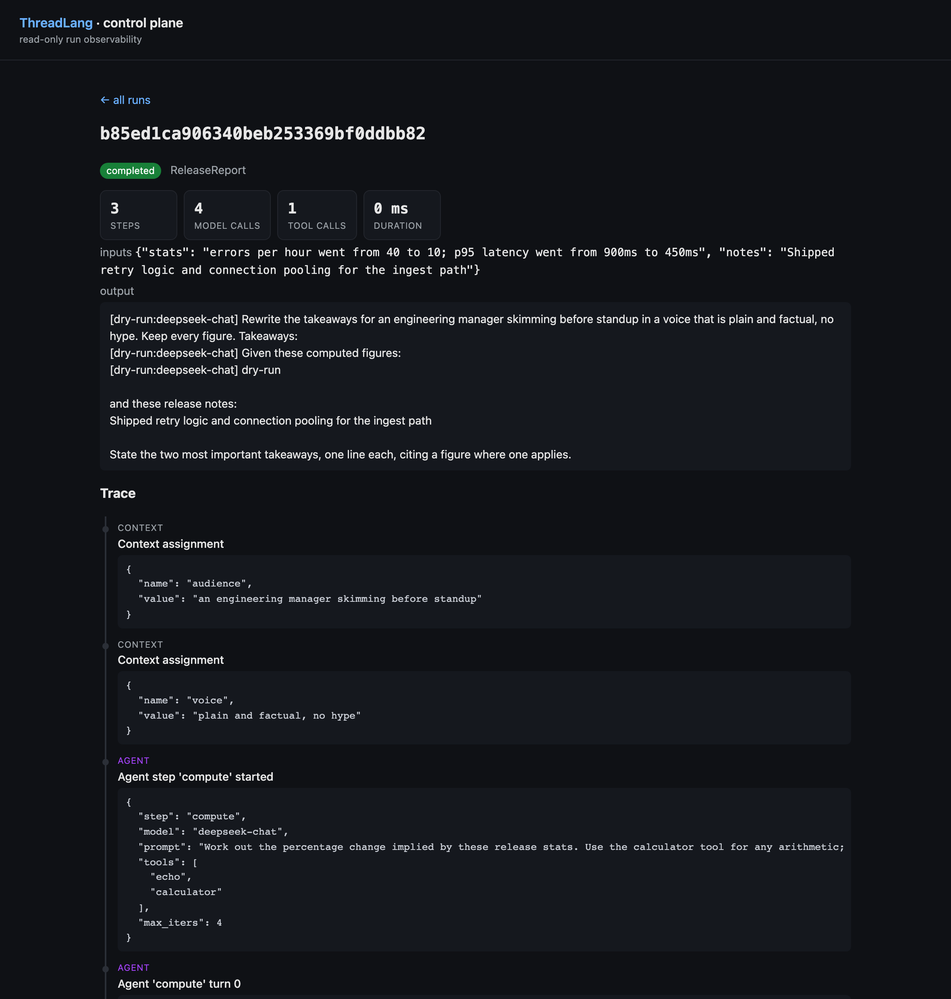

# ThreadLang

[](https://github.com/minglong51/threadlang/actions/workflows/ci.yml)

A compact DSL and single-node runtime for **bounded, traceable LLM and agent
workflows**. ThreadLang validates a workflow graph, executes model and tool
calls within explicit limits, and records every binding, step, model turn, tool
call, and result as a structured trace.

The current source version is **v0.13.3 (alpha)**. It includes:

- model and allow-listed [agentic tool-use steps](#agentic-steps-v03);
- durable SQLite execution with [checkpoint, resume, and replay](#durability-v04);
- an authenticated [control plane](#control-plane-v05) and read-only
  [trace dashboard](#observability-v06);
- forward-only [routing](#routing-v09), enforceable [output contracts](#contracts-v011),
  and repeat-run [reliability probes](#probes-v010);
- canonical Workflow IR v1 with deterministic JSON, definition fingerprints,
  strict untrusted-JSON loading, and compatibility execution through the
  established AST runtime.

The support boundary is deliberately narrow: one POSIX process, one local
SQLite store, and at-least-once LLM calls across a hard crash. Design records
and deliberate cuts live in [`docs/design/`](docs/design/).

```thread
thread TwoStep {
  context {
    audience = "a curious 10-year-old"
  }

  steps {
    step extract {
      llm "claude-haiku-4-5-20251001" {
        "Extract the three most important claims from this text. Reply as a numbered list, no preamble. Text:\n" + inputs.text
      }
    }
    step retell {
      llm "claude-haiku-4-5-20251001" {
        "Rewrite the following claims for " + context.audience + ". Keep the meaning, change the words. Claims:\n" + steps.extract.output
      }
    }
  }

  emit text {
    steps.retell.output
  }
}
```

## Install

ThreadLang requires Python 3.11 or newer. Install the published package:

```bash
python -m pip install threadlang                # core + OpenAI-compatible backend, zero runtime deps
python -m pip install 'threadlang[anthropic]'  # optional Anthropic client
```

Or install the current source:

```bash
git clone https://github.com/minglong51/threadlang.git
cd threadlang
python -m pip install .                  # core + OpenAI-compatible backend, zero runtime deps
python -m pip install '.[anthropic]'     # optional Anthropic client
```

## Run

```bash
# v0 string interpolation (no LLM)
threadlang examples/hello.thread --input name=world
# → Hello, world!

# v1 with a real Claude call (needs ANTHROPIC_API_KEY)
threadlang examples/summarize.thread --input text="The cat sat on the mat..."

# v1 dry-run — works without an API key; LLM calls are deterministic echoes
threadlang examples/two_step.thread --input text="..." --dry-run

# show structured trace events
threadlang examples/two_step.thread --input text="..." --dry-run --trace

# v0.3 agent step — runs a tool-use loop (dry-run needs no API key)
threadlang examples/agent.thread --input task="what is 21*2?" --dry-run --trace

# fuller pipeline — an agent step feeding two llm steps, run durably with metrics
threadlang examples/release_report.thread \
  --input stats="errors per hour went from 40 to 10; p95 latency went from 900ms to 450ms" \
  --input notes="Shipped retry logic and connection pooling for the ingest path" \
  --dry-run --store runs.db --metrics
```

## Backends

The model is the only non-deterministic part of a run; everything around it is
deterministic and traced. Pick the backend with `--backend` — the cheap/open
path is first-class, not an afterthought:

```bash
# Open / low-cost (default for agent examples): any OpenAI-compatible endpoint.
# Hosted DeepSeek — reliable native tool-calling, a few cents per run:
export THREADLANG_API_KEY=sk-...      # DeepSeek key
threadlang examples/agent.thread --input task="what is 21*2?" --backend openai

# Free local Ollama (no key, runs on your own GPU) — great for llm/complete steps:
threadlang examples/summarize.thread --input text="..." \
  --backend openai --base-url http://<host>:11434/v1
#   (set the model name in the .thread file to a pulled model, e.g. qwen2.5-coder:14b)

# Premium — Anthropic Claude:
export ANTHROPIC_API_KEY=sk-ant-...
threadlang examples/agent.thread --input task="what is 21*2?" --backend anthropic
```

| Backend | Flag | Auth | `llm` steps | `agent` tool-calls |
|---|---|---|---|---|
| Dry-run (echo) | `--dry-run` | none | deterministic stub | deterministic stub |
| OpenAI-compatible | `--backend openai` | `THREADLANG_API_KEY` (optional for local) | ✓ | ✓ when the model emits native `tool_calls` |
| Anthropic | `--backend anthropic` | `ANTHROPIC_API_KEY` | ✓ | ✓ |

`--backend openai` talks to any `/v1/chat/completions` server (DeepSeek, Ollama,
vLLM, Together, …) over stdlib HTTP — no SDK. Tool-calling rides the OpenAI
`tools`/`tool_calls` shape; DeepSeek supports it natively. Some local models
(e.g. `qwen2.5-coder:14b` via Ollama's `/v1`) describe the call as text instead
of emitting native `tool_calls` — use them for `llm`/`complete` steps, and
DeepSeek (or Claude) for `agent` steps.

Provider selection fails closed: a requested real backend never silently
downgrades to dry-run output. `OPENAI_API_KEY` is read only for the official
`https://api.openai.com` endpoint; compatible endpoints use
`THREADLANG_API_KEY` or an explicit programmatic key. Keys require HTTPS unless
the endpoint is loopback; loopback HTTP bypasses environment proxies, and
unkeyed local HTTP endpoints remain supported. Provider redirects are refused,
base URLs cannot embed credentials, query parameters, or fragments, and
OpenAI-compatible response bodies are capped at 8 MiB. Invalid Unicode and
malformed tool-call payloads fail closed before execution.

## Agentic steps (v0.3)

An `agent` step is a model that can *act*. It runs a tool-use loop — model →
tool calls → observations → model — until the model returns a tool-free
answer or `max_iters` is hit:

```thread
step solve {
  agent "claude-haiku-4-5-20251001" {
    tools [ echo, calculator ]
    max_iters 4
    "Use a tool if it helps. Task: " + inputs.task
  }
}
```

- **`tools [...]`** is an allow-list. The model can only call tools named here,
  and only the `ToolRegistry` can turn a name into executable code — that pair
  is the execution boundary.
- **`max_iters`** bounds the loop (default `6`).
- Built-in deterministic tools: `echo`, `calculator` (side-effect-free, so the
  loop runs end-to-end under `--dry-run`). Register your own via
  `run_program(..., tools=my_registry)`.
- Every model turn, tool call, and tool result is a `TraceEvent` — the entire
  agent run reconstructs from the trace.

## Durability (v0.4)

A run can persist to a sqlite store: its `TraceEvent` stream becomes a durable
event log, each completed step is checkpointed, and the run carries an id +
status. If it crashes, resume it from the last completed step — no re-running
finished work.

```bash
# Persist a run; retryable provider-call failures print a resume command
threadlang examples/two_step.thread --input text="..." --backend openai --store runs.db

# A retryable provider-call failure prints a copyable command with the original backend settings.
# Persisted inputs are loaded from the run; completed steps are skipped.
threadlang examples/two_step.thread --store runs.db --resume <id> \
  --backend openai
```

```python
from threadlang import parse_program, run_durable, RunStore

store = RunStore("runs.db")
try:
    durable = run_durable(parse_program(src), {"text": "..."}, store)
    durable.run_id                          # the run's id
    store.get_run(durable.run_id).status    # 'completed' | 'failed' | 'running'
    store.load_events(durable.run_id)       # the persisted trace
    store.list_runs()                       # all runs (for a dashboard)
finally:
    store.close()
```

The runtime stays storage-agnostic — `run_durable` hands it a write-through
trace and a checkpoint callback, so the same executor runs durable or
ephemeral. Checkpoints are step-level; a crash mid-step re-runs that step,
finished steps are reused. Replaying a *completed* run returns the stored
result and makes no model calls. Details:
[`docs/design/phase-2-durability.md`](docs/design/phase-2-durability.md).

## Control plane (v0.5)

Submit runs over HTTP and let a worker pool execute them. The `pending` rows in
the run store *are* the queue — no extra broker — so the queue survives a
restart, and because workers run on the durable path, a worker that crashes
mid-run is recovered by re-dispatching the same id.

```bash
# Start the API + workers (stdlib http.server; zero deps)
threadlang-serve --store runs.db --port 8765 --workers 2 --backend openai

# Enqueue a run → get an id back immediately
curl -X POST localhost:8765/runs -H 'content-type: application/json' \
  -d '{"source":"thread T { context{} steps{} emit text { inputs.x } }","inputs":{"x":"hi"}}'
# → {"run_id": "ab12…", "status": "pending"}

curl localhost:8765/runs/ab12…     # status + output + full persisted trace
curl localhost:8765/runs           # list all runs
```

| Method / path | Does |
|---|---|
| `POST /runs` | enqueue exactly one of `{source, inputs}` or `{ir, inputs}` (validated first) → `run_id` |
| `GET /runs?limit=&offset=` | paginated run summaries |
| `GET /runs/{id}` | one run: status, output, error, and the persisted trace |
| `GET /healthz` / `GET /readyz` | database liveness / worker readiness + queue depth |

Built from `process_one` (claim + run one queued run) and a `WorkerPool` of
threads; the claim is atomic so no run executes twice. Details:
[`docs/design/phase-3-control-plane.md`](docs/design/phase-3-control-plane.md).

## Observability (v0.6)

The control-plane server also hosts a read-only dashboard over the persisted
trace — no extra process, no build step, no JavaScript. The trace has been the
durable record since v0.1; this is the layer that lets a human read it.



```bash
threadlang-serve --store runs.db --port 8765 --workers 2 --backend openai
# then open:
#   http://localhost:8765/            run list (status + output, links to each run)
#   http://localhost:8765/ui/runs/ab12…   one run: status, inputs, output, trace timeline
```

| Path | Renders |
|---|---|
| `GET /` (or `/ui`) | run list — every run, status badge, links to detail |
| `GET /ui/runs/{id}` | one run: status, inputs, output/error, and the `TraceEvent` timeline |

The detail page renders the full event stream — context bindings, step calls,
agent turns, tool calls, tool results — as a phase-colored timeline, so an agent
run reconstructs visually from exactly the data L3 persists. A run still
`pending`/`running` auto-refreshes so its timeline updates live; a settled run
is static. All model output and trace data is `html.escape`d before rendering —
untrusted text never reaches the page raw. Details:
[`docs/design/phase-4-observability.md`](docs/design/phase-4-observability.md).

## Vertical slice: support-triage (v0.7)

The first product *on* the stack — proof the layers compose into something a
user runs. Given a support ticket it runs a two-step program: an `agent` step
classifies priority and searches a knowledge base using the app's **own tools**,
then an `llm` step drafts a customer reply. It is an ordinary durable run, so it
checkpoints, enqueues over the API, and renders on the dashboard with no
app-specific support.

```bash
# one ticket, durably, in-process — deterministic, no key
support-triage run --ticket "The dashboard is down with 500s, urgent" --dry-run

# real model with native tool-calling (DeepSeek, Claude, or a compatible local model)
support-triage run --ticket "..." --backend openai

# or serve the API + workers + dashboard with the app's tool registry wired in
support-triage serve --store runs.db --backend openai
#   POST /runs {"source": <triage.thread>, "inputs": {"ticket": "..."}}
```

The app lives in `src/threadlang/apps/support_triage/` and adds **no core
machinery** — a program (`triage.thread`), a tool registry (`build_registry()`
extends the built-ins with `classify_priority` + `search_kb`), and a thin
entrypoint. The one core change is `serve(tools=...)`, so any app can serve its
own programs over the same API. `classify_priority` is deterministic keyword
rules (no model call — cheap, inspectable); the model is spent only on the
draft. Because the tools are pure and `DryRunClient` fires the first
allow-listed tool with placeholder arguments, the plumbing runs end-to-end
under `--dry-run` and is golden-tested. Dry-run does not validate ticket
classification, KB-search coverage, or reply quality; use a real tool-calling
model for those semantics. Details:
[`docs/design/phase-5-vertical-slice.md`](docs/design/phase-5-vertical-slice.md).

## Metrics (v0.8)

Metrics are a **derived view of the trace, never a separately-reported number.**
Every metric is a pure fold over the persisted `TraceEvent` stream, so it cannot
drift from what the dashboard timeline shows, and adding a new metric gives it
to every historical run for free. Two kinds, kept deliberately apart:

- **Deterministic** — pure functions of control flow (steps completed, model
  calls, tool calls/errors, resumed steps). Reproducible given the same inputs
  and model responses.
- **Observational** — wall-clock latency and token counts. Not reproducible;
  recorded for monitoring but never mixed into the deterministic core. A `None`
  token count means "not recorded", distinct from a real zero.

```bash
# per-run metrics on the CLI (with --store, includes wall-clock latency)
threadlang examples/agent.thread --dry-run --input task=… --store runs.db --metrics
```

| Path | Returns |
|---|---|
| `GET /metrics` | aggregate rollup — success rate, avg latency, model/tool-call volume, per-program breakdown |
| `GET /runs/{id}/metrics` | one run's `{deterministic, observational}` metrics |

The dashboard shows the aggregate panel atop the run list and per-run metric
chips on each detail page — same numbers, same source events. `metrics.py`
holds the pure `compute_metrics(trace) -> RunMetrics` fold and `aggregate(...)`;
the store layer adds an `events.ts` column (wall-clock at append) and
`run_metrics` / `aggregate_metrics` query helpers. Token capture from the live
clients is the one piece deferred: the worker pool shares one client and
requires it hold no mutable per-call state, so usage will ride a future
return-shape change rather than client-side state — the fold already reads
`data.usage` the moment it appears.

## Routing (v0.9)

A `route` step turns the step list into a **node graph**: the model makes one
bounded decision — which arm label fits — and deterministic code does the jump.
The output contract ("reply with exactly one of: ...") is generated from the
arms; a non-matching reply is traced as a violation and retried once with the
violation fed back, then falls to `else ->` or fails loud.

```thread
step classify {
  route "deepseek-chat" {
    "Decide how to handle this request: " + inputs.task
    on "math" -> solve_math
    on "writing" -> draft
    else -> draft
  }
}
```

- Any step can end with `then -> <step|end>`; default is fall-through, so
  existing programs are untouched. `end` skips to emit.
- The graph is a **forward-only DAG** (targets must be declared later), so
  every step runs at most once — checkpoints, resume, and replay work
  unchanged. A resumed route re-derives its jump from the stored label with
  no model call.
- `steps.<name>.output?` renders as `""` when routing skipped the step — how
  emit or a join step reads branch outputs. The non-`?` form fails loud.
- The routing decision, each rejection, and the chosen edge are `route`-phase
  `TraceEvent`s; metrics gain `route_steps` / `route_violations` and the
  dashboard shows both.
- Runs under `--dry-run` (first arm chosen deterministically):

```bash
threadlang examples/route.thread --input task="what is 21*2?" --dry-run --trace
```

Design notes: [`docs/design/phase-6-routing.md`](docs/design/phase-6-routing.md).

## Probes (v0.10)

A controllability probe turns "structure reduces variance" from a claim into a
number: run the same program N times against a real backend, persist every run,
and fold them into a stability report. Change a prompt, a contract, or a
decomposition; re-probe; compare.

```bash
threadlang examples/route.thread --input task="what is 21*2?" \
  --backend openai --store probes.db --probe 20
```

```json
{
  "runs": 20, "completed": 20, "failed": 0, "failure_rate": 0.0,
  "route_violations": 1,
  "steps": [
    {"step": "classify", "kind": "route", "runs": 20, "distinct_outputs": 1,
     "mode_frequency": 1.0, "label_counts": {"math": 20}},
    {"step": "solve_math", "kind": "agent", "runs": 20, "distinct_outputs": 4,
     "mode_frequency": 0.85}
  ],
  "output": {"distinct": 4, "mode_frequency": 0.85}
}
```

- The report is a **pure fold over the persisted runs** (same doctrine as
  metrics) — recomputable from the store, never a separately-reported number.
  That's why `--probe` requires `--store`.
- Every probe run is an ordinary durable run — dashboard-visible, with its own
  trace. Failed runs are data (`failure_rate`), not errors.
- `mode_frequency` = share of executions producing the most common output:
  1.0 is perfectly stable (the `--dry-run` baseline), 1/runs is maximal
  instability. Steps skipped by routing in every run report `runs: 0`, never
  false stability. Route steps carry their full label histogram — their output
  space is closed, so the distribution is the decision behavior.
- Variance is exact-match only by design (no embeddings): honest and coarse for
  freeform steps, exact for contracted ones.

Design notes: [`docs/design/phase-7-probes.md`](docs/design/phase-7-probes.md).

## Contracts (v0.11)

Route steps have carried an output contract since v0.9; `expect` gives one to
any `llm` step. Declare what an acceptable reply is, and the runtime — not the
prompt author's hope — holds the line:

```thread
step verdict {
  llm "deepseek-chat" {
    "Should this change ship? " + inputs.change
    expect {
      one_of "ship", "hold"
    }
  }
}
```

- Four rules, one per line, all must hold: `one_of "a", "b"` (closed set,
  route-label normalization, the canonical value is what gets bound),
  `matches "<regex>"` (fullmatch, repeatable), `max_chars N`, `nonempty`.
  All validated at parse time — a bad regex fails before any model call.
- The rendered contract is appended to the prompt, so the model is shown
  exactly what will be enforced. A violating reply is traced (`contract`
  phase), retried once with every violation named in the feedback, and a
  second violation **fails the run** — contracts are hard requirements, so
  there is no `else` edge here.
- Violations fold into `contract_violations` in metrics, the dashboard, and
  the probe report — probe a program before and after adding a contract and
  the stability delta is a number.
- A `one_of` contract is a closed-enum call and reuses the `route` client
  protocol, so it runs under `--dry-run` deterministically (first value):

```bash
threadlang examples/contract.thread --input change="rename a log field" --dry-run
```

Design notes: [`docs/design/phase-8-contracts.md`](docs/design/phase-8-contracts.md).

## Language

```
context   — deterministic values available during execution     [yes]
steps     — a forward-only DAG of llm / agent / route nodes     [yes]
  · llm   — call a model with a rendered prompt                 [yes]
  · agent — tool-use loop over an allow-listed tool registry    [v0.3]
  · route — enum-contracted decision; arms are the edges        [v0.9]
  · then -> <step|end> — explicit edge on llm/agent steps       [v0.9]
  · expect — output contract on llm steps (one_of / matches
    / max_chars / nonempty), enforced with feedback retry       [v0.11]
emit text — string concatenation over expression terms          [yes]
emit llm  — call a model with a rendered prompt                 [yes]
```

Expression terms (joined with `+`):

- string literal: `"hello"`
- context value: `context.<name>`
- input value: `inputs.<name>`
- prior step output: `steps.<step_name>.output` (append `?` to render `""`
  instead of failing when routing skipped the step)

Full grammar in [`docs/grammar.ebnf`](docs/grammar.ebnf); semantics in
[`docs/spec.md`](docs/spec.md).

## What this deliberately does not have yet

Still narrow on purpose: no cycles/recursion (branching is forward-only —
iteration lives inside `agent` steps, bounded by `max_iters`), no streaming,
no system prompts, no real type system, and no sandbox for arbitrary custom
Python tool implementations. Durable execution rejects tools declared as both
side-effecting and non-idempotent. Each broader capability is a real addition with its own design surface, sequenced
behind the platform layers below rather than bolted on early.

## Project shape

- Zero runtime dependencies. The OpenAI-compatible backend (DeepSeek / Ollama /
  vLLM …) ships in core over stdlib HTTP; `anthropic` is an *optional* extra; the
  `DryRunClient` lets you run any program — agent steps included — without either.
- Frozen dataclass AST nodes (`src/threadlang/ast.py`); `Step` (llm) and
  `AgentStep` are distinct node types.
- Canonical Workflow IR v1 (`src/threadlang/ir.py`) losslessly compiles the
  v0.12 AST into deterministic JSON and a SHA-256 definition fingerprint. It
  supports strict untrusted-JSON loading and compatibility execution through an
  explicit IR→AST bridge. New durable runs bind and integrity-check the stored
  canonical definition; the established AST interpreter remains authoritative.
- Parser (`src/threadlang/parser.py`) — a position-aware lexer and
  recursive-descent parser with string/comment-aware delimiters, full-input
  consumption, static graph/reference validation, and line/column diagnostics.
- Deterministic runtime (`src/threadlang/runtime.py`) returns
  `(output, trace, step_outputs)`. Every binding, step call, agent turn, tool
  call, and tool result appends a `TraceEvent`.
- LLM-client protocols (`src/threadlang/llm.py`) — `complete(model, prompt)`
  for `llm` steps, `agent_step(model, messages, tools)` for `agent` steps.
  Backends: `OpenAICompatClient` (DeepSeek / Ollama / any `/v1`), `AnthropicClient`,
  `DryRunClient`. Per-step model names are the cost-routing lever — cheap open
  model for easy steps, a strong model only where it earns it.
- Tools (`src/threadlang/tools.py`) — `ToolRegistry` allow-list +
  `FunctionTool` wrapper + deterministic built-ins.
- Durable store (`src/threadlang/store.py`) — `RunStore` (stdlib sqlite) +
  `run_durable`; the trace becomes a persisted event log with step checkpoints
  and resume-from-failure. The runtime stays storage-agnostic.
- Control plane (`src/threadlang/control.py`, `server.py`) — `process_one` +
  `WorkerPool` drain the store's `pending` runs; a stdlib `http.server` JSON API
  enqueues and reports them. The queue is the store; no extra broker.
- Observability (`src/threadlang/dashboard.py`) — pure `(record, events) -> HTML`
  render functions for a read-only run list + per-run trace timeline, served by
  the same `http.server` on `/` and `/ui/runs/{id}`. Server-rendered, inline CSS,
  zero JS; all untrusted text is `html.escape`d.
- Vertical-slice app (`src/threadlang/apps/support_triage/`) — a product *on*
  the stack: a triage program, an app-owned tool registry (`build_registry`
  extends the built-ins), and a `support-triage` entrypoint. Adds no core
  machinery; runs as an ordinary durable/queued/observable run.

## Roadmap — the platform layers

ThreadLang is the authoring + execution core of a bounded, single-node agent
platform. Each shipped layer keeps the determinism/trace bet:

1. **Agentic core** *(v0.3, shipped)* — tools + agent tool-use loop.
2. **Durability** *(v0.4, shipped)* — sqlite run store; the trace becomes an
   event log, so runs checkpoint and resume from failure.
3. **Control plane** *(v0.5, shipped)* — an API + worker pool draining a
   durable run queue.
4. **Observability** *(v0.6, shipped)* — a read-only run list + per-run
   trace-timeline dashboard, served by the same control-plane process.
5. **Vertical-slice app** *(v0.7, shipped)* — a support-triage product on the
   stack (agent classify + KB search → llm draft), proving the layers compose
   end to end with no new core machinery.
6. **Metrics** *(v0.8, shipped)* — deterministic + observational metrics
   *derived* from the persisted trace (`metrics.py`), surfaced per-run and as an
   aggregate rollup on the dashboard and `GET /metrics`. The substrate a
   data-driven self-improvement loop reads.
7. **Routing** *(v0.9, shipped)* — programs become forward-only node graphs:
   `route` steps make enum-contracted decisions, deterministic code dispatches
   the edges, and checkpoints/resume/replay survive branching unchanged.
8. **Probes** *(v0.10, shipped)* — controllability probes: `--probe N` runs a
   program repeatedly and folds the stored runs into per-step variance,
   route-label distributions, and violation/failure rates — reliability as a
   measurement, not a claim.
9. **Contracts** *(v0.11, shipped)* — `expect { ... }` output contracts on
   llm steps (one_of / matches / max_chars / nonempty), enforced with one
   feedback retry and failing loud; violations are trace events that metrics
   and probes fold.
10. **Bounded production profile** *(v0.12, shipped)* — fail-closed resource policy,
    parser hardening, authenticated single-node control plane, source/input
    integrity binding, exclusive worker ownership, CAS resume, packaging,
    security gates, and a non-root container. The support boundary is one POSIX
    process and one local SQLite store; LLM calls remain at-least-once across a
    hard crash. See [`docs/production.md`](docs/production.md),
    [`SECURITY.md`](SECURITY.md), and the
    [semantic comparison](docs/benchmarks/dsl-comparison.md).
11. **Canonical Workflow IR** *(v0.13, shipped)* — deterministic JSON and
    definition fingerprints, strict untrusted-JSON loading, AST compatibility
    execution, durable definition binding, and source-or-IR control-plane
    submissions.

## Stay in the loop

New tools and field notes on running AI agents with discipline go to the
[Agent Discipline](https://buttondown.com/minglong51) list first — launch
notes, operational patterns, early access. A few emails a month at most.

## License

MIT — see [LICENSE](LICENSE).
